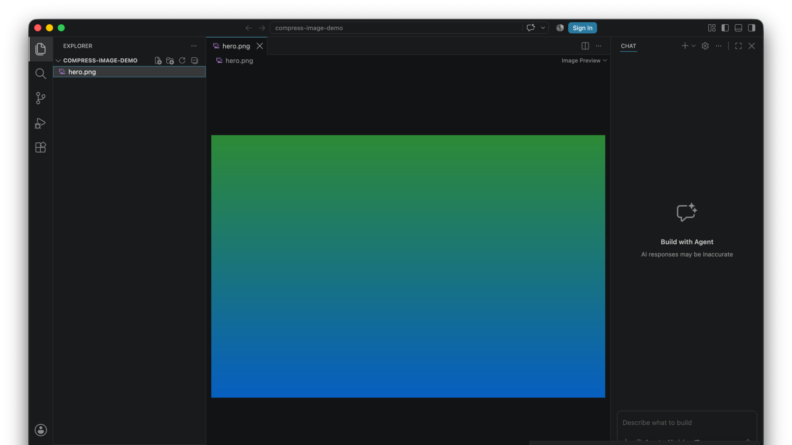

# Compress Image

[](https://github.com/Serbyte-Development/compress-image/actions/workflows/ci.yml)
[](LICENSE)

<!--
[](https://marketplace.visualstudio.com/items?itemName=serbytedevelopment.compress-image)
[](https://marketplace.visualstudio.com/items?itemName=serbytedevelopment.compress-image)
[](https://open-vsx.org/extension/serbytedevelopment/compress-image)
-->

Shrink supported raster image assets in place from VS Code with validation-backed lossless output — no uploads, no quality slider, no configuration.



- **One action.** Right-click a supported image in the Explorer and choose **Compress Image**.
- **Validation-backed lossless output.** A candidate is accepted only when decoded pixels/frames and the format-specific fields checked by the extension match the original.
- **Never grows a file.** The original stays untouched unless a validated candidate is smaller.
- **Local and private.** Compression runs on your machine with bundled optimizers; images are never uploaded.
- **Strict format scope.** PNG/APNG, JPEG, static WebP, and GIF are supported in v0.1.0.

**Developed & maintained by [Serbyte Development](https://www.serbyte.net/)** · [GitHub](https://github.com/Serbyte-Development)

## Usage

1. Find a supported image in the VS Code Explorer.
2. Right-click it.
3. Select **Compress Image**.

The file is optimized in place only when the result is both smaller and identical under the format-specific validation described below. VS Code shows the before/after size and percentage saved.

## Supported formats

| Format     | Optimizer                | Validation required before replacement                                                                         |
| ---------- | ------------------------ | -------------------------------------------------------------------------------------------------------------- |
| PNG / APNG | OxiPNG 10.2.0            | Exact decoded RGBA pixels/frames, dimensions, APNG timing/loop/frame controls, validated metadata fields       |
| JPEG / JPG | MozJPEG 4.1.5 `jpegtran` | Exact decoded RGBA pixels, dimensions, orientation/density, validated metadata fields                          |
| WebP       | libwebp 1.6.0 `cwebp`    | Exact decoded RGBA pixels including hidden RGB under transparent pixels, dimensions, validated metadata fields |
| GIF        | Gifsicle 1.96            | Exact decoded frames, dimensions, frame timing, loop behavior, validated metadata fields                       |

"Validated metadata fields" means the fields explicitly compared by the extension: orientation, density, alpha presence, and ICC/EXIF/IPTC/XMP blobs when exposed by Sharp for that format. It is not a claim that every possible ancillary container chunk is preserved.

Animated WebP is intentionally rejected rather than modified. AVIF, TIFF, BMP, and other formats are not supported in v0.1.0.

## Safety model

Compress Image does not trust an optimizer result just because the command succeeded.

For every candidate it:

1. Snapshots decoded image output and the format-specific fields listed above.
2. Creates optimized candidates in a temporary directory next to the source file.
3. Rejects candidates that are not smaller.
4. Decodes and compares the candidate against the original snapshot.
5. Replaces the original only after validation passes.
6. Keeps a temporary backup during replacement and restores it if the write fails.

PNG/APNG validation includes frame-level controls. JPEG orientation/density and exposed ICC/EXIF/IPTC/XMP metadata are compared. Static WebP uses `-exact` so RGB values under fully transparent pixels remain intact and is still rejected unless decoded pixels and validated fields match.

## Compression strategy

- **PNG/APNG:** races strong OxiPNG candidates, with bounded Zopfli work for smaller files. Interlaced PNGs may be deinterlaced only when validation proves equivalent output.
- **JPEG:** races optimized progressive and baseline coefficient-level MozJPEG `jpegtran` output. Replacement still requires identical decoded pixels and validated fields.
- **WebP:** uses official libwebp `cwebp` at maximum lossless preset with exact transparent RGB preservation.
- **GIF:** uses Gifsicle `-O3`, then validates the animation before replacement.

## Platforms

Releases are platform-specific because Compress Image ships native optimization tools.

- macOS arm64 (Apple Silicon)
- macOS x64 (Intel)
- Linux arm64 (glibc)
- Linux x64 (glibc)
- Windows x64

Windows ARM64, Alpine Linux, browser/web extensions, and virtual workspaces are not supported in v0.1.0.

The extension runs as a VS Code **workspace extension**. In Remote SSH, WSL, or dev-container sessions, the matching platform build must be installed in the remote extension host.

## VS Code and Cursor

VS Code `1.96.0` or newer is required. Cursor uses the VS Code extension model, but registry availability and platform behavior should be treated separately; see the release notes for builds that have been smoke-tested there.

## Development

Requires Node.js 22 or newer for the current `@vscode/vsce` toolchain.

```sh
npm ci
npm run check
npm run audit:runtime
npm run package:vsix
```

`npm run package:vsix` creates a VSIX for the current operating system and CPU architecture. Native binaries and redistribution licenses are acquired or built during `npm ci` and are checksum/version validated where upstream artifacts permit it.

## Support

For bugs, compatibility problems, or focused feature requests, open an issue in the GitHub repository. See [SUPPORT.md](SUPPORT.md) for the information that helps reproduce compression problems.

## License

Compress Image is MIT licensed. Bundled optimizers and libraries keep their own licenses; see [THIRD_PARTY_NOTICES.md](THIRD_PARTY_NOTICES.md). The Gifsicle source archive is included in each VSIX alongside its GPLv2-licensed executable.
