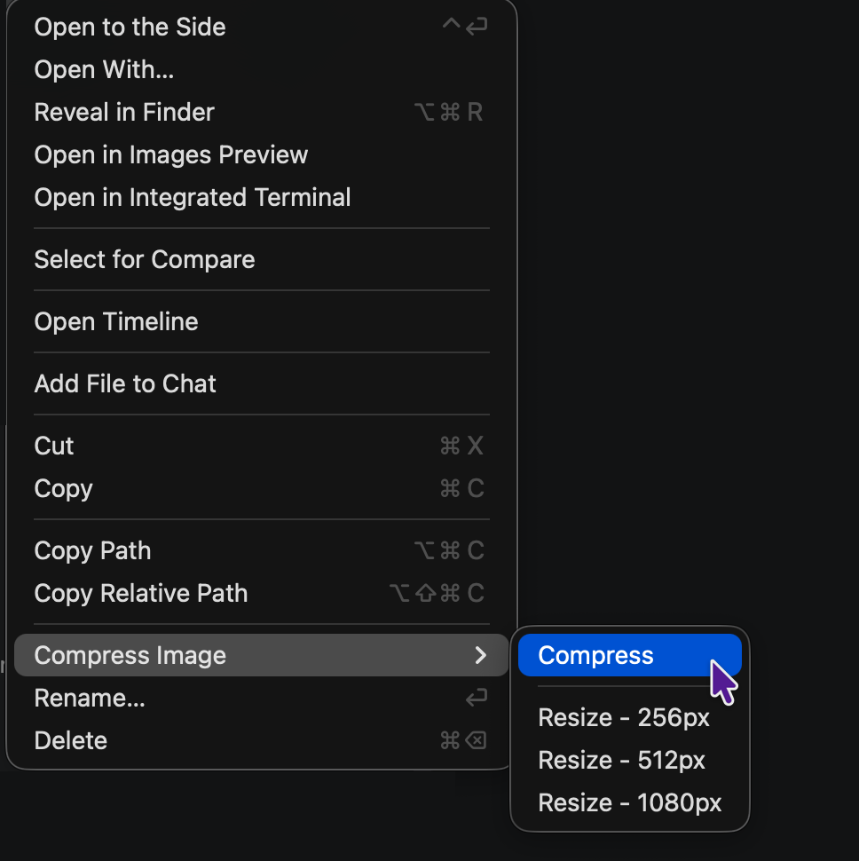
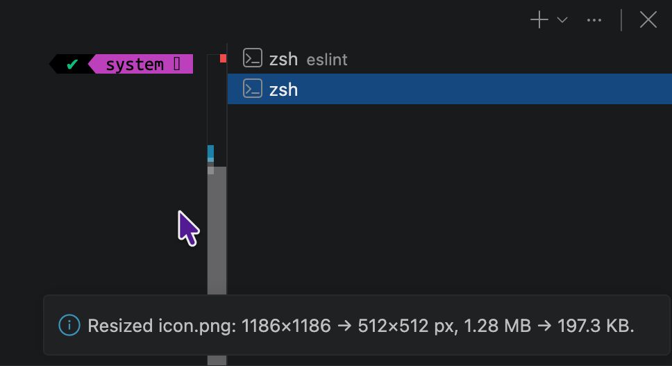

# Compress Image

[](https://github.com/Serbyte-Development/compress-image/actions/workflows/ci.yml)
[](LICENSE)

<!--
[](https://marketplace.visualstudio.com/items?itemName=serbytedevelopment.compress-image)
[](https://marketplace.visualstudio.com/items?itemName=serbytedevelopment.compress-image)
[](https://open-vsx.org/extension/serbytedevelopment/compress-image)
-->

Compress and resize images directly from the VS Code Explorer. No uploads, no quality sliders, and no configuration.



## What it does

- **Compress in place.** Right-click a supported image and run **Compress Image → Compress**.
- **Resize in one click.** Choose **Resize - 256px**, **Resize - 512px**, or **Resize - 1080px** from the same menu.
- **Never upscales.** Resize only changes images wider than the selected target width.
- **Preserves aspect ratio.** No cropping, padding, stretching, or format conversion.
- **Optimizes after resize.** Resized images automatically go through the normal format-specific optimizer.
- **Never replaces a file with a larger compression result.** A compression candidate must be smaller and pass validation before it can replace the original.
- **Runs locally.** Images never leave your machine.

## Usage

1. Find a supported image in the VS Code Explorer.
2. Right-click the image.
3. Open **Compress Image**.
4. Choose one action:
   - **Compress**
   - **Resize - 256px**
   - **Resize - 512px**
   - **Resize - 1080px**

Resize values are target **widths**. Height is calculated automatically from the original aspect ratio. If the image is already at or below the selected width, it is left unchanged.

After a successful operation, Compress Image reports the result and size change in VS Code.



## Supported formats

| Format     | Compress           | Resize                   | Optimizer                |
| ---------- | ------------------ | ------------------------ | ------------------------ |
| PNG        | Yes                | Yes                      | OxiPNG 10.2.0            |
| APNG       | Yes                | No                       | OxiPNG 10.2.0            |
| JPEG / JPG | Yes                | Yes                      | MozJPEG 4.1.5 `jpegtran` |
| WebP       | Static only        | Static only              | Sharp 0.35.3             |
| GIF        | Yes                | Yes, including animation | Sharp 0.35.3             |
| AVIF       | Static 8/10/12-bit | Static 8/10/12-bit       | Sharp 0.35.3             |

Animated WebP, APNG resize, AVIF image sequences, and multi-image AVIF files are rejected rather than flattened or silently changed. HEIC, TIFF, BMP, SVG, and other formats are not supported in v0.1.0.

## Compression behavior

Compress Image uses strong format-specific lossless optimization where it is practical, then validates the result before replacing the original file.

- **PNG / APNG:** OxiPNG uses `-o 1`, with a validated deinterlaced candidate for interlaced inputs. This favors interactive speed while keeping strong lossless savings.
- **JPEG:** MozJPEG `jpegtran` uses progressive coefficient-level optimization with `-fastcrush`, avoiding image-sample re-encoding while skipping the expensive progressive scan search.
- **Static WebP:** Sharp uses lossless WebP at effort 6 with exact transparent RGB preservation.
- **GIF:** Sharp uses lossless GIF optimization while preserving and validating frame count, timing, and loop behavior.
- **Static AVIF:** Sharp uses lossless AVIF encoding at effort 4 and requests the source 8/10/12-bit depth when available.

Compression is **best-effort lossless**. PNG/APNG, JPEG, WebP, and GIF use strict decoded-output validation. AVIF uses visible-image validation through the ordinary decoded image path; exact high-bit sample precision is not part of the validation contract.

A candidate is accepted only when it is smaller than the original and passes the format-specific checks. If no candidate qualifies, the original file stays untouched.

## Resize behavior

Resize uses high-quality Lanczos3 resampling and keeps the source format.

- Target width only; height follows the original aspect ratio.
- Never crops, pads, stretches, or upscales.
- EXIF orientation is applied to the pixels before resize.
- EXIF and IPTC are intentionally stripped from resized output.
- ICC and XMP are preserved when the format and encoder expose them cleanly.
- Animated GIF frame count, timing, and loop behavior are preserved and validated.
- The resized image is optimized again before the final file is written.

JPEG resize necessarily re-encodes image samples because the dimensions change.

## Validation and safe replacement

Compress Image does not trust an optimizer just because it exited successfully. Before replacing the source file it checks the relevant decoded image and container properties for that format.

For compression, validation includes decoded pixels or frames, dimensions, animation timing/loop data where applicable, and selected metadata such as orientation, density, ICC, EXIF, IPTC, and XMP when exposed by the decoder. An optimizer may remove an unused fully opaque alpha channel when the decoded RGBA image is unchanged.

Temporary candidates are created beside the source file. The original is replaced only after a smaller candidate passes validation, and a temporary backup is kept during replacement so a failed write can be restored.

## Platforms

Compress Image ships native optimization tools, so releases are platform-specific.

- macOS arm64 — Apple Silicon
- macOS x64 — Intel
- Linux arm64 — glibc
- Linux x64 — glibc
- Windows x64

Windows ARM64, Alpine Linux, browser/web extensions, and virtual workspaces are not supported in v0.1.0.

VS Code `1.96.0` or newer is required. Cursor uses the VS Code extension model, but registry availability and platform behavior are separate from VS Code Marketplace support.

The extension runs as a VS Code **workspace extension**. In Remote SSH, WSL, or dev-container sessions, the matching platform build must be installed in the remote extension host.

## Development

Node.js 22 or newer is required for the current development and packaging toolchain.

```sh
npm ci
npm run check
npm run audit:runtime
npm run package:vsix
```

`npm run package:vsix` builds a VSIX for the current operating system and CPU architecture. Native binaries and redistribution licenses are acquired or built during `npm ci` and version/checksum validated where upstream artifacts permit it.

### Compression benchmark

The repository includes a standalone compression benchmark over a separate eight-image corpus under `benchmark/fixtures/`. The benchmark corpus is deliberately small and realistic; the regression-oriented files under `test/fixtures/` remain available separately.

The benchmark compares encoder time against output size and runs each candidate through the extension's normal compression validation. This makes it useful for both tuning effort levels and deciding whether a Sharp-only implementation could replace a specialized native optimizer without violating the compression contract.

```sh
npm run benchmark:compression
```

Useful filters:

```sh
npm run benchmark:compression -- --format png
npm run benchmark:compression -- --format webp --runs 3
npm run benchmark:compression -- --fixture transparent-graphic
npm run benchmark:compression -- --corpus regression --format png
```

The benchmark currently compares:

- OxiPNG `-o 1`, `-o 4`, `-o 6`, and `-o max` against Sharp PNG compression, plus the historical bounded Zopfli candidate on small files.
- MozJPEG baseline, full progressive, and progressive `-fastcrush` coefficient optimization against Sharp JPEG re-encoding at quality 100, including Sharp's MozJPEG mode.
- Sharp lossless WebP efforts 4 and 6.
- Sharp GIF efforts 7 and 10.
- Sharp lossless AVIF effort 4, 6, and 9.

Encoder time is measured separately from validation time. With multiple runs, the benchmark reports median encoder time. The decision table also shows total bytes, whether each strategy actually produced a smaller valid candidate, speed relative to the fastest fully valid strategy, and extra bytes relative to the smallest fully valid strategy.

A strategy that produces a smaller file but fails validation is reported as a benchmark finding rather than causing the benchmark itself to fail. This is important when comparing Sharp decode/re-encode paths with the stricter lossless behavior of tools such as `jpegtran`.

## Support

For bugs, compatibility problems, or focused feature requests, open an issue in the GitHub repository. See [SUPPORT.md](SUPPORT.md) for the information that helps reproduce compression problems.

## License

Compress Image is MIT licensed. Bundled optimizers and libraries keep their own licenses; see [THIRD_PARTY_NOTICES.md](THIRD_PARTY_NOTICES.md).

**Developed and maintained by [Serbyte Development](https://www.serbyte.net/).**
